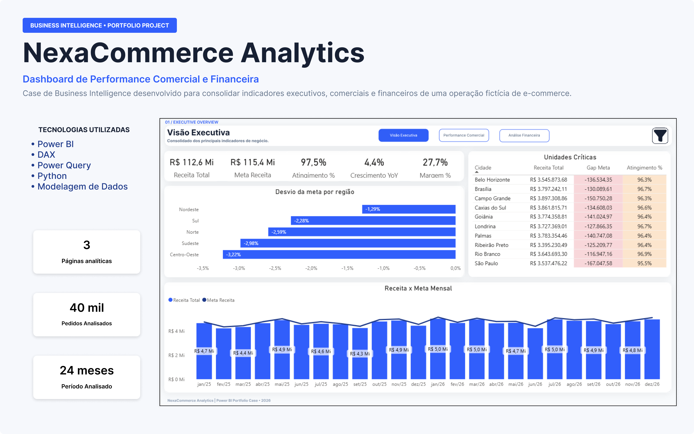
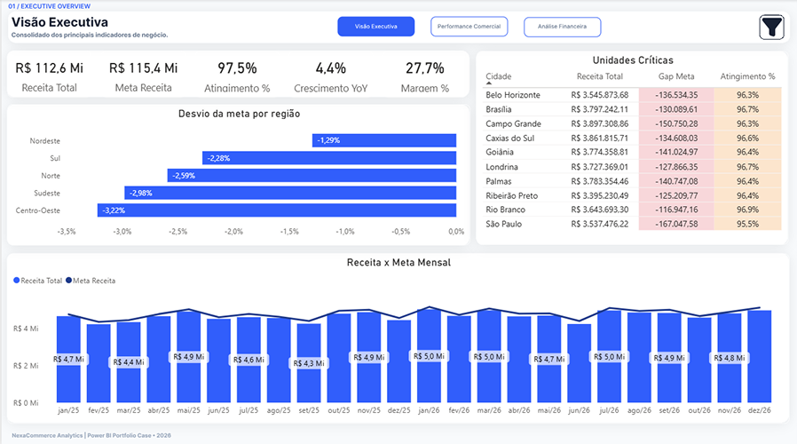
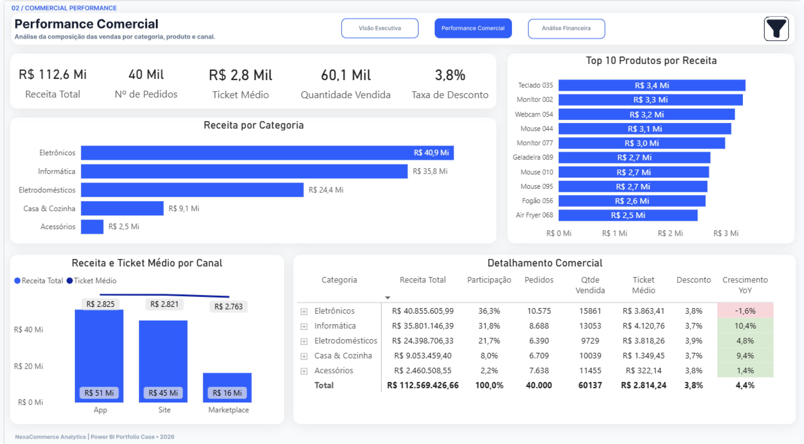
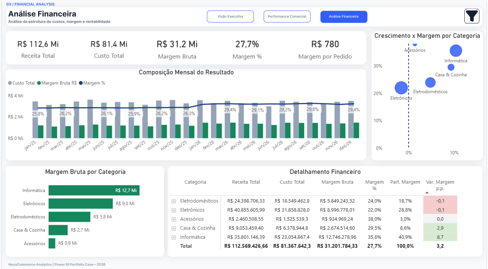
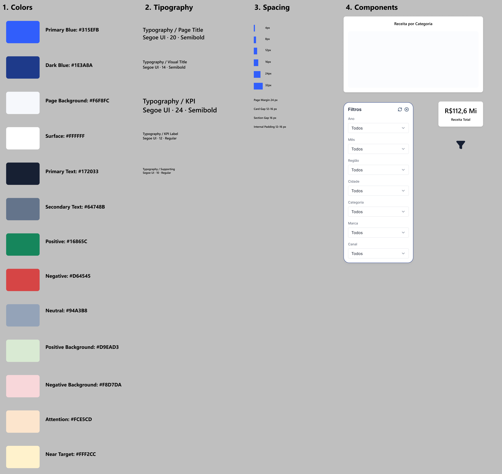

# NexaCommerce Analytics

Business Intelligence case study focused on commercial performance, executive indicators and financial analysis for a fictional e-commerce operation.

## About the Project

NexaCommerce Analytics is a Business Intelligence portfolio project developed to simulate the analytical environment of an e-commerce operation.

The project combines data modeling, KPI development, dashboard design and business analysis to provide different perspectives of business performance.

## Business Context

The case was structured around three analytical perspectives:

- Executive performance
- Commercial performance
- Financial performance

The objective was to organize business indicators into an analytical environment that supports performance monitoring and decision-making.

## Analytical Approach

The analysis was divided into three dashboard perspectives:

### Executive Overview

Provides a consolidated view of revenue, target achievement, growth, margin and regional performance.

### Commercial Performance

Analyzes revenue by category, product and channel, highlighting commercial composition and performance.

### Financial Analysis

Analyzes revenue, costs and margins to provide a financial perspective of the operation.

## Technologies

- Power BI
- DAX
- Power Query
- Python
- SQL / Data Modeling
- Figma

## Key Deliverables

- 3 analytical dashboards
- 40K transactions analyzed
- 24-month analysis period
- KPI development
- Data modeling
- Interactive navigation and filtering
- Dashboard Design System
- Business-oriented data visualization
- Project documentation

## Design System

The project also includes a visual system designed to maintain consistency between the analytical dashboards and the project documentation.

## Project Documentation

The complete project documentation is available in PDF format:

[View the complete NexaCommerce Portfolio](docs/NexaCommerce_Analytics_Portfolio.pdf)

## Disclaimer

This is a fictional Business Intelligence case created for portfolio and learning purposes. The data and business context do not represent a real company or commercial operation.
